# Project management dashboard

This web application is a Project Management Dashboard designed to track tasks, assignments, status, and deadlines managed by a team of four members. Each team member is responsible for a specific section: John manages Tasks, Elizabeth handles Assignments, Michael tracks Status, and Emily oversees Deadlines. The dashboard allows adding upcoming tasks and displays previously completed tasks in the admin panel. For new members joining the company, there is a separate task assignment page, which can be viewed from the admin panel.

  

## HOME PAGE

This is the main landing page displayed when entering the site.  
The Recent Activity, Upcoming Deadlines, and Announcements sections showcase the latest updates, providing company-level operational information and examples of entered data.

  

## HOME PAGE — JavaScript Functionality

When user enter the Task, Assigned To, Status, and Deadline fields in the Task List section the Vanilla JavaScript function running in the background updates the data in the Project Progress and Quick Stats sections. 
This allows the company’s current status to be viewed instantly.

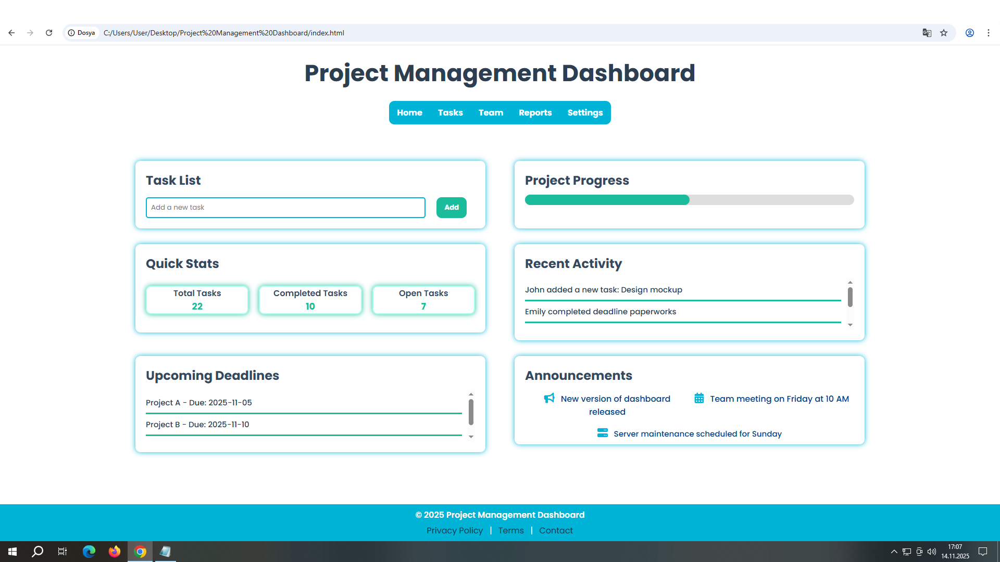

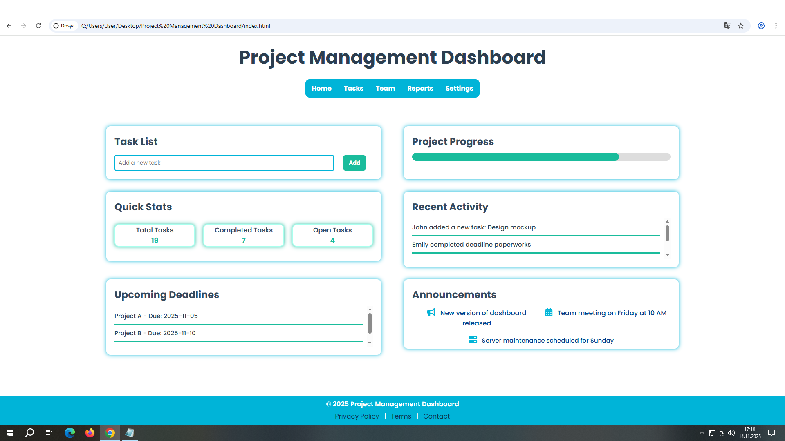

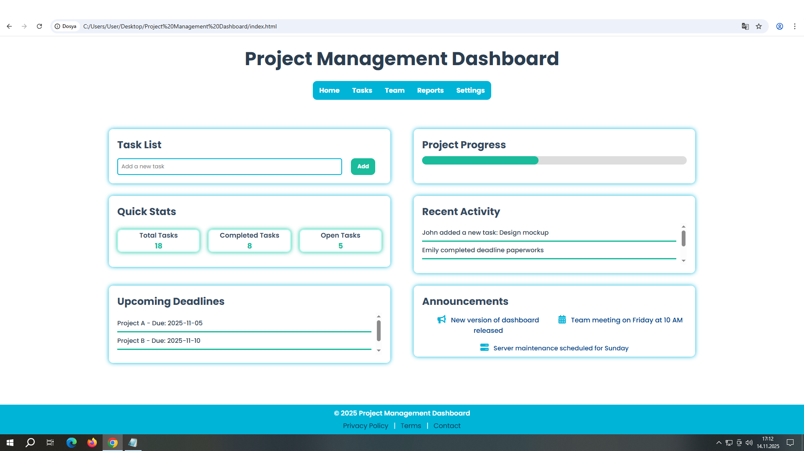

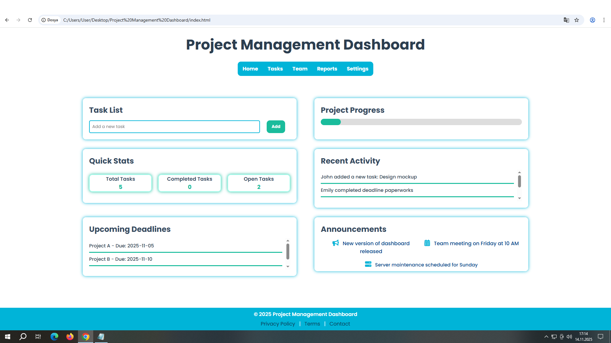

  

## Tasks Page

This page displays upcoming tasks assigned to four different team members.  
Through the JavaScript function running in the background, the user first enters the team member's name, followed by the task's date.  
The system then displays the team member's name, the assigned task, and the corresponding start date beneath it.

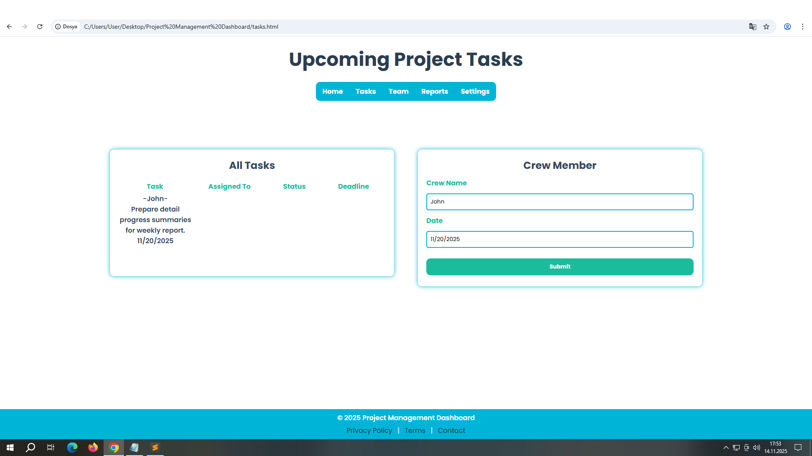

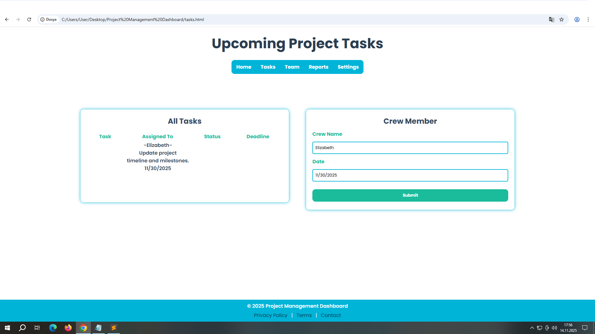

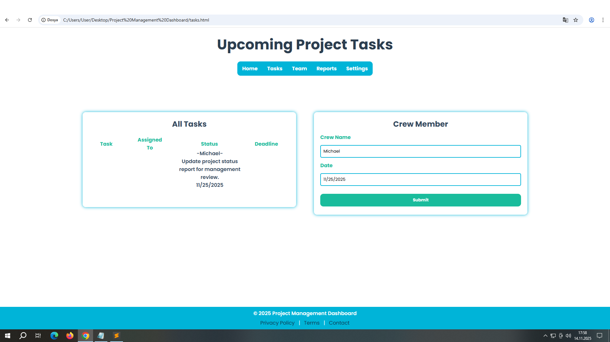

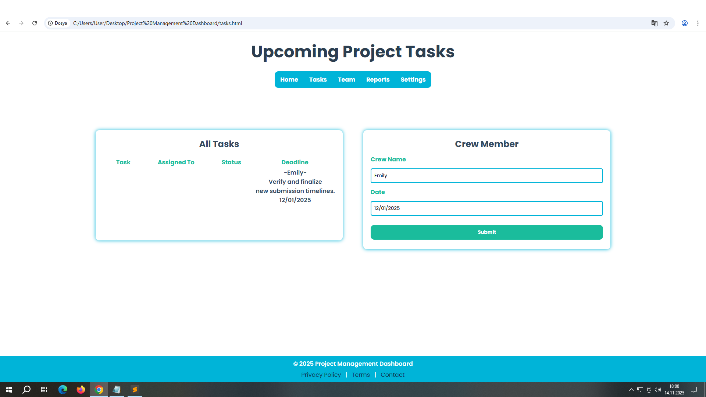

  

## Team Page

This page displays the information of new team members powered by a JavaScript function running in the background.  
For the four team members, their team number, department, and joining date are shown.  
After clicking the "Add Member" button, the new member's name, role, and email address appear in the left panel.

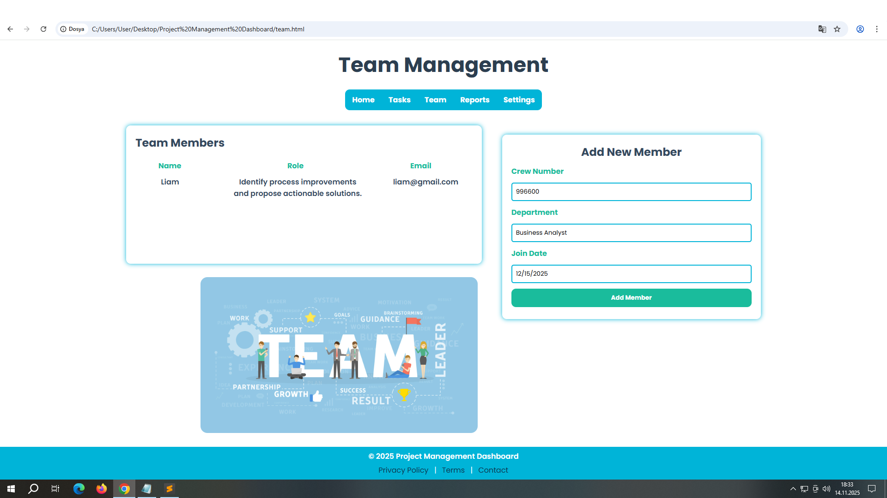

  

## Reports Page

This page is designed to display the company's data in percentages.  
By entering any number in the JavaScript section the values and ratios are automatically calculated and updated.  
It shows the variability of the company in the Project Overview and Performance Charts sections.

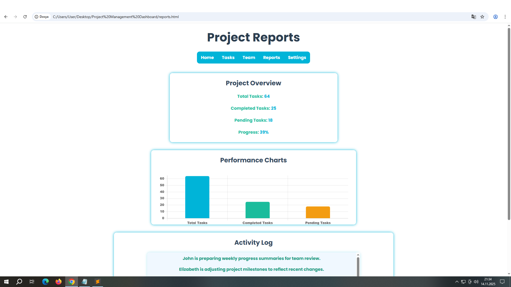

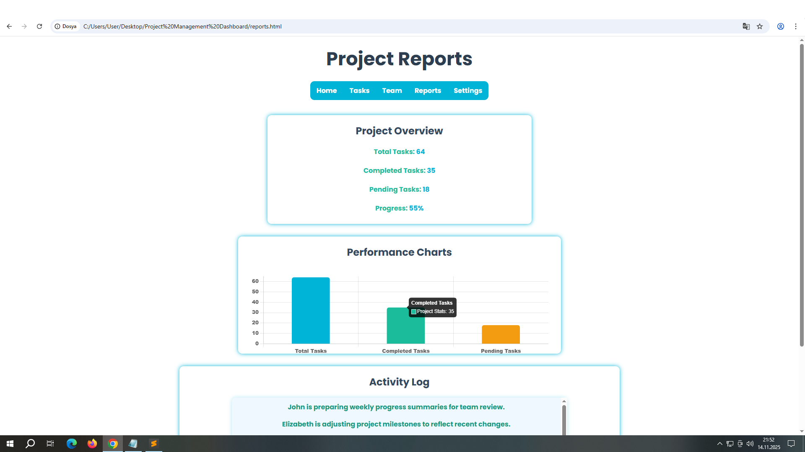

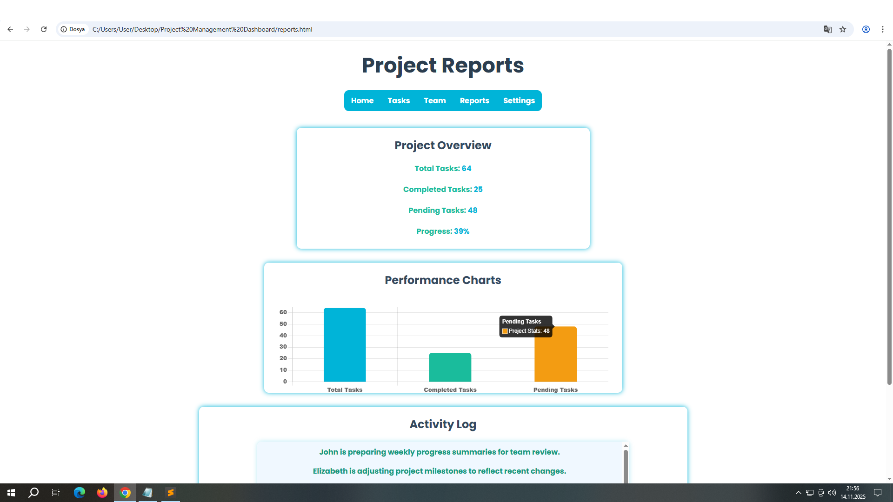
